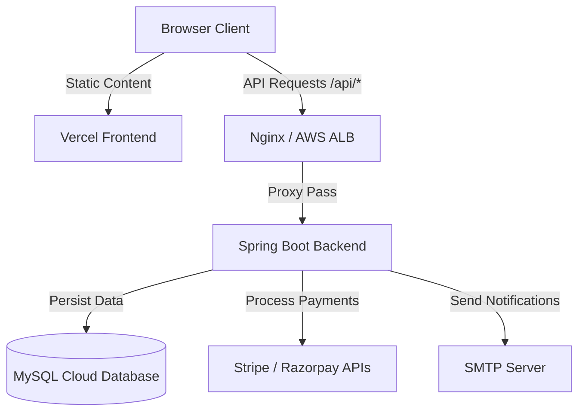

# VEHA Jewelry - Production Deployment Guide

This guide walks you through deploying the VEHA Jewelry e-commerce store to production environments.

---

## Architecture Overview



- **Frontend**: Served statically on **Vercel**.
- **Backend**: Deployed as a Docker container on **Render** or **AWS App Runner**.
- **Database**: Hosted on **AWS RDS MySQL** or **PlanetScale**.

---

## 1. Database Setup (MySQL)

1. Create a MySQL database instance (e.g. AWS RDS or PlanetScale).
2. Note down the Connection Parameters:
   - Host name
   - Port (Default `3306`)
   - Database name (`veha_db`)
   - Username and Password
3. Run the schema migrations from `backend/src/main/resources/schema.sql` to initialize tables, followed by `backend/src/main/resources/data.sql` to seed default categories and catalog items.

---

## 2. Backend Deployment (Render or AWS)

### Option A: Render Deployment (Fastest)

1. Create a new account on **Render** (https://render.com).
2. Click **New +** and select **Web Service**.
3. Connect your GitHub repository containing the project.
4. Select **Docker** as the runtime. Render will automatically detect the `Dockerfile` at the root.
5. In **Advanced**, add the following **Environment Variables**:
   - `SPRING_DATASOURCE_URL`: `jdbc:mysql://<your-db-host>:3306/veha_db?useSSL=true`
   - `SPRING_DATASOURCE_USERNAME`: `<your-db-user>`
   - `SPRING_DATASOURCE_PASSWORD`: `<your-db-password>`
   - `SPRING_MAIL_HOST`: `smtp.sendgrid.net` (or your mail provider)
   - `SPRING_MAIL_PORT`: `587`
   - `SPRING_MAIL_USERNAME`: `<your-smtp-username>`
   - `SPRING_MAIL_PASSWORD`: `<your-smtp-password>`
   - `STRIPE_API_KEY`: `<your-stripe-secret-key>`
   - `RAZORPAY_KEY_ID`: `<your-razorpay-key-id>`
   - `RAZORPAY_KEY_SECRET`: `<your-razorpay-key-secret>`
6. Click **Deploy Web Service**. Render will compile and serve the backend.

### Option B: AWS Deployment (ECS / App Runner)

1. Build the Docker image locally and push it to AWS ECR:
   ```bash
   aws ecr get-login-password --region us-east-1 | docker login --username AWS --password-stdin <aws-account-id>.dkr.ecr.us-east-1.amazonaws.com
   docker build -t veha-backend .
   docker tag veha-backend:latest <aws-account-id>.dkr.ecr.us-east-1.amazonaws.com/veha-backend:latest
   docker push <aws-account-id>.dkr.ecr.us-east-1.amazonaws.com/veha-backend:latest
   ```
2. Create an **AWS App Runner** service pointing to the ECR image repository.
3. Configure the environment parameters under the Service Settings tab.

---

## 3. Frontend Deployment (Vercel)

1. Sign up on **Vercel** (https://vercel.com).
2. Import the root repository.
3. Vercel will prompt you for project settings. Configure:
   - **Framework Preset**: `Vite`
   - **Root Directory**: `frontend`
   - **Build Command**: `npm run build`
   - **Output Directory**: `dist`
4. To point to your live backend domain, modify the base URL inside `frontend/src/utils/api.ts`:
   ```typescript
   const API_BASE_URL = 'https://your-backend-domain.onrender.com/api';
   ```
5. Click **Deploy**. Vercel will build the React SPA and host it on its global CDN edge networks.

---

## 4. Local Orchestration (Docker Compose)

To test the entire production setup locally:

1. Compile the React frontend to generate the `dist` folder:
   ```bash
   cd frontend
   npm install
   npm run build
   cd ..
   ```
2. Create a `.env` file from `.env.example`:
   ```bash
   cp .env.example .env
   ```
3. Add your mail credentials and API keys in `.env`.
4. Launch the container stack:
   ```bash
   docker-compose up --build
   ```
5. Access the e-commerce client at `http://localhost`. Nginx will route requests dynamically to `/usr/share/nginx/html` (react frontend dist) and proxy `/api/*` requests to the Spring Boot backend.
